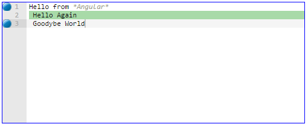

# ngAce

A simple wrapper around [Ace editor](http://ace.c9.io/)


## Setup

Inside your HTML, load the script and use the directive:

```html
<script src="ngAce.js"></script>

<ace ace-config='ace' mode='cobol' theme='github'></ace>
```

Inside your Angular code, add the module as a dependency and setup the model: 

```javascript
var app = angular.module('app', ['ngAce']);
```

Inside your controller:

```javascript
$scope.ace = {
    text : 'Hello from *Angular*\n Hello Again\n Goodybe World',
    isReadOnly : true,
    markedLines : [2],
    breakpoints: [1,3]
};
````

Finally, give the directive a width so its contents are visible:

```css
.editor {
	width: 300px;		
}
```

If you want the built in styles, include the demo css and its related image files.


Result: 




## Usage

Just update your model, and the directive will take care of updating the view.
See the [demo page](https://rawgit.com/jxc876/ngAce/master/demo/index.html) for some examples.


## Customize

To change the look of the currently selected line use the following css:

    .highlighted-row

To change the look of the breakpoints use the following css: 

    .ace_gutter-cell.ace_breakpoint 

